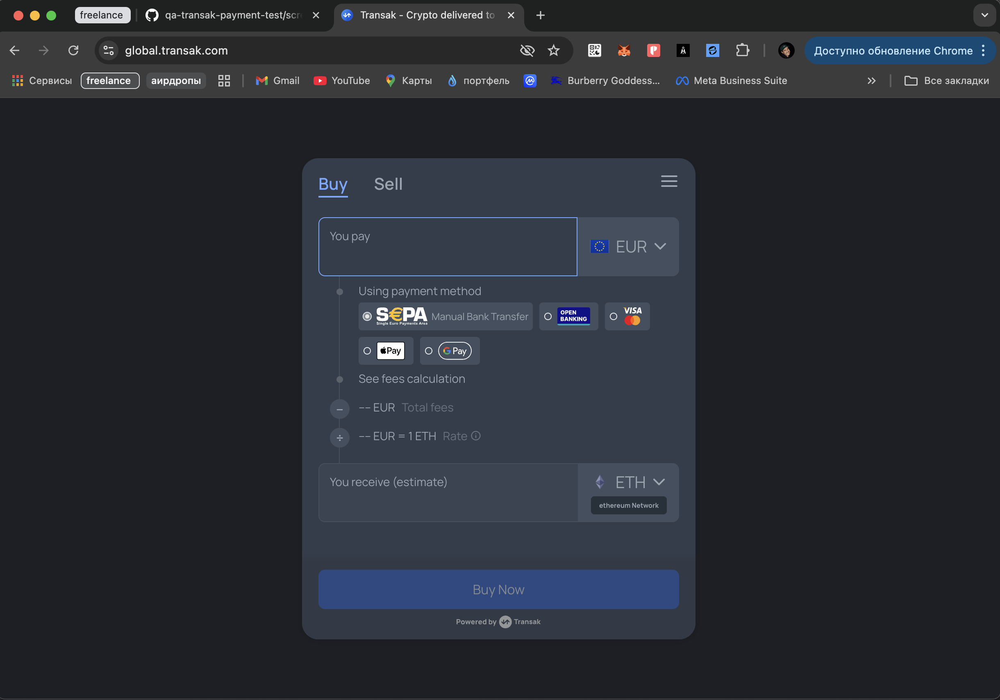
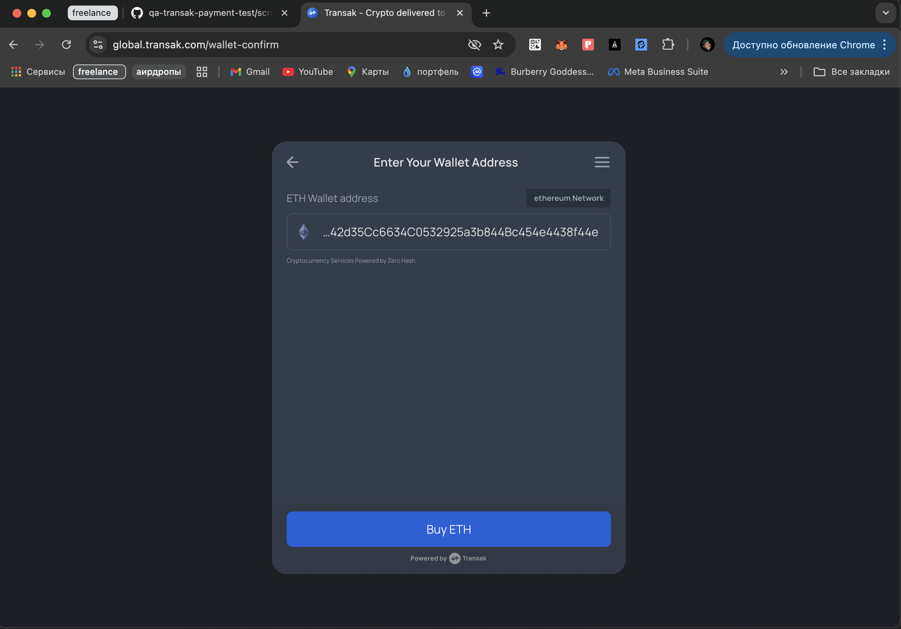
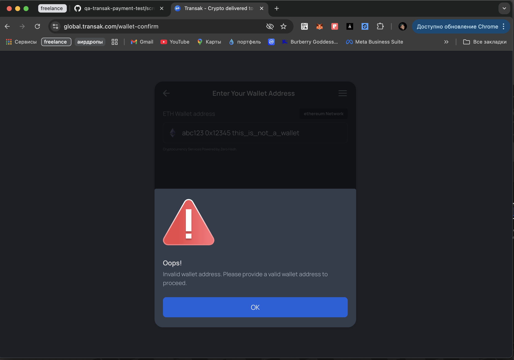
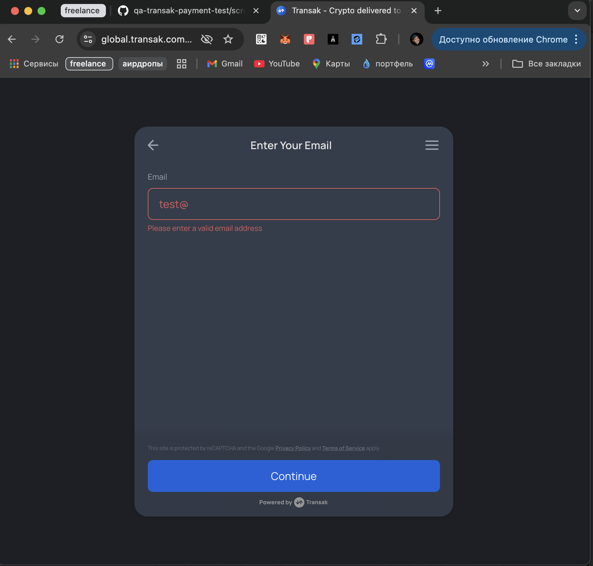
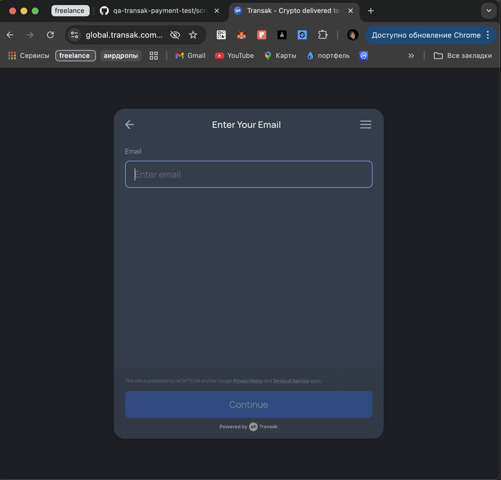
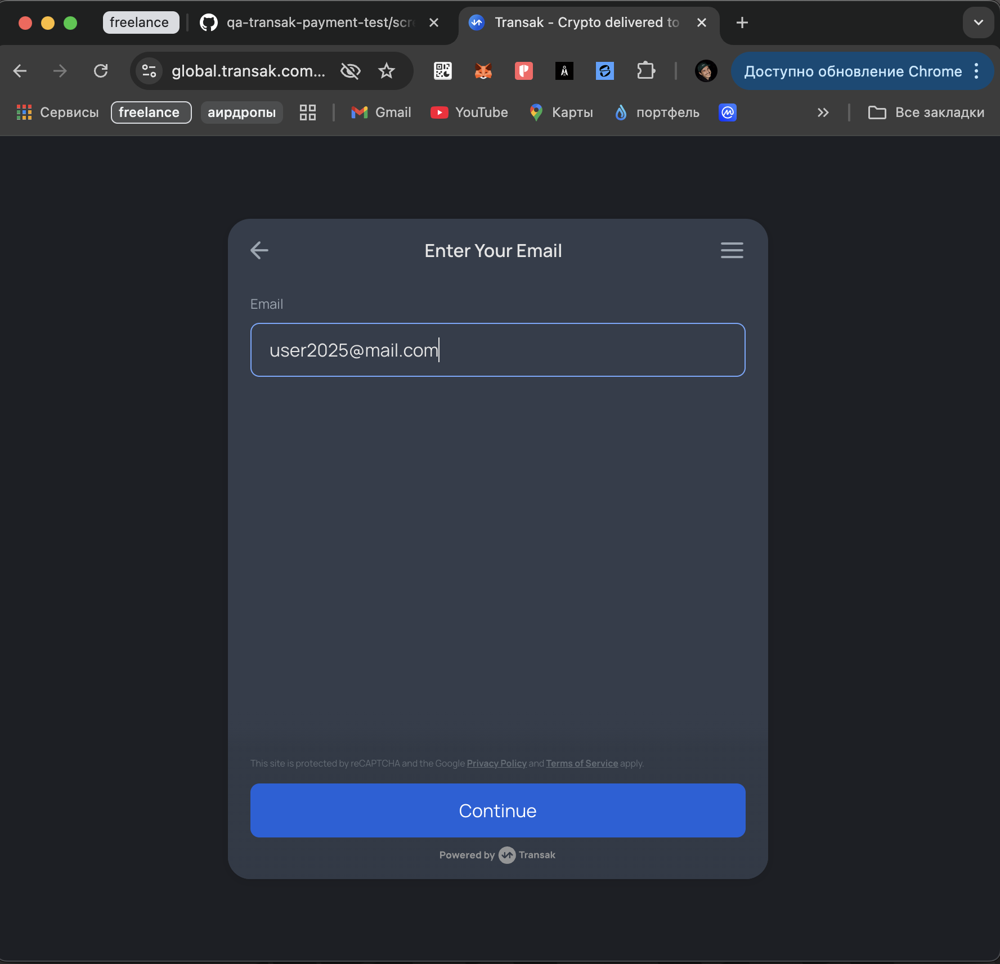
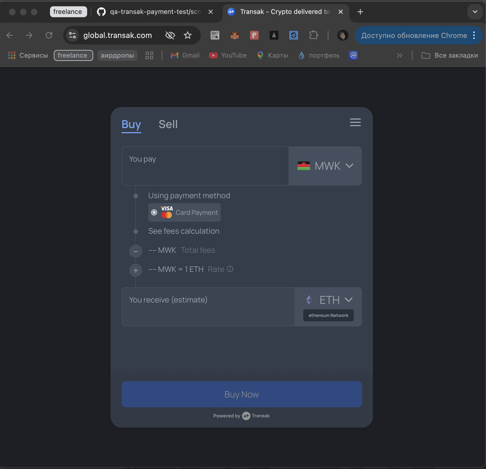
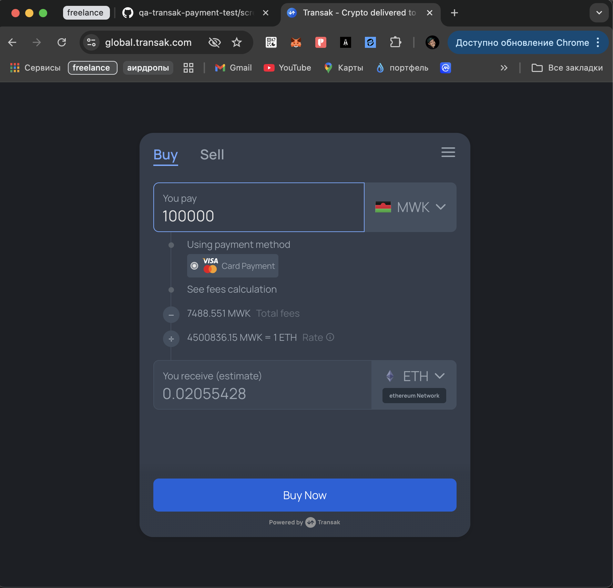
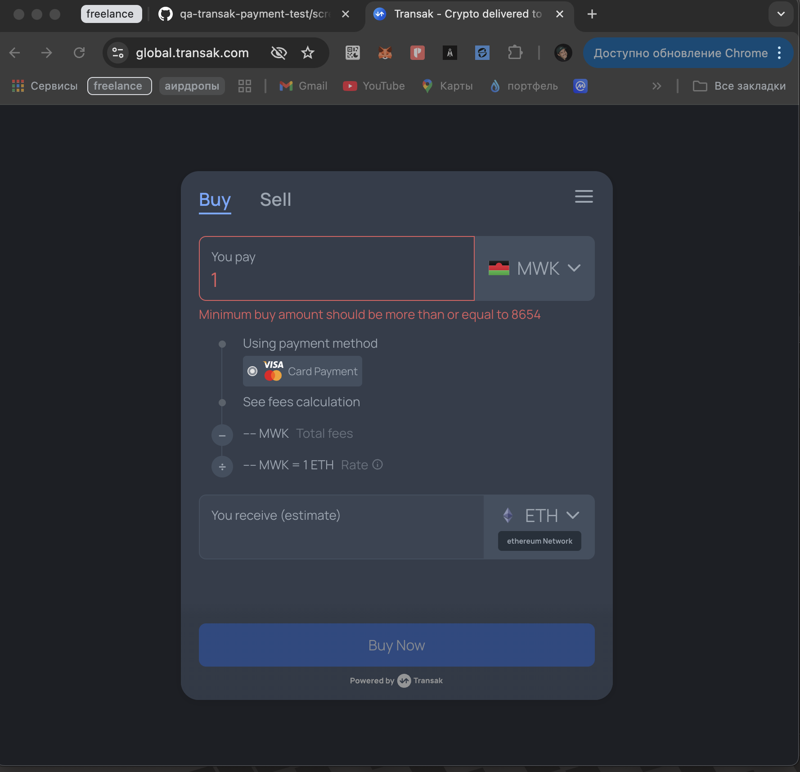
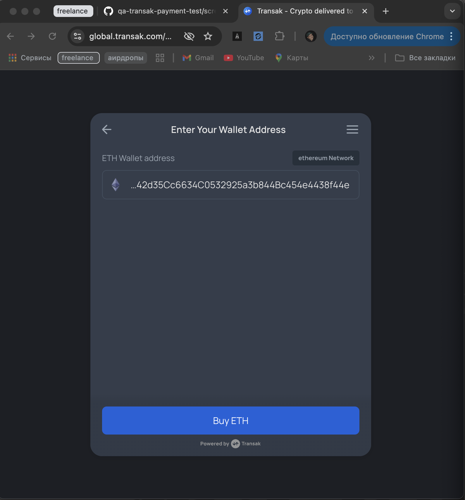

# Transak Payment Widget — QA Manual Testing Report

📋 Manual QA testing of [Transak.io](https://global.transak.com) fiat-to-crypto widget.  
Tested flows for USD and MWK currencies → ETH purchase simulation.

---

## ✅ Tested Blocks

### 💵 USD → ETH

#### 💰 Amount Input
- ✅ Accepts valid value
- ✅ Blocks letters and symbols
- ✅ Shows correct rate and fees
📸 Screenshot:  

#### 🔁 Invalid Inputs
- 🔴 Letters, symbols: rejected

- 🔴 Negative: rejected  

#### 👛 Wallet Address
- ✅ Valid ETH passes  

- 🔴 Invalid is blocked  

#### 📧 Email Field
- 🔴 Invalid email: error  

- 🔴 Empty email  

- ✅ Valid email passes  

---

### 🌍 MWK (Malawi) → ETH

#### 🔽 MWK selected  

#### 💰 Amount input
- ✅ Valid amount with rate/fees  

- 🔴 Below minimum rejected  

#### 👛 Wallet Address
- ✅ Valid ETH address  

- 🔴 Invalid: error  

---

## 🔍 Summary

| Area                 | Result     |
|----------------------|------------|
| Amount validation    | ✅ Passed  |
| Wallet validation    | ✅ Passed  |
| Email validation     | ✅ Passed  |
| Multi-currency test  | ✅ Passed  |
| UX feedback & errors | ✅ Clear   |

---

## 📌 Notes

- Tests performed on **15 May 2025**
- No funds were used — simulation only
- This is a QA case study, not development work
